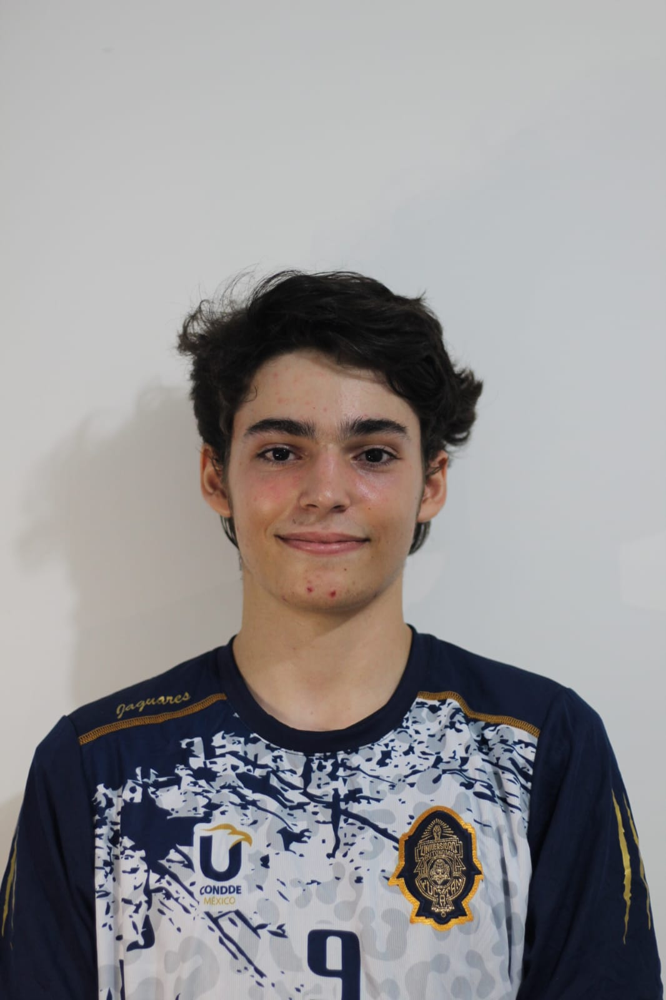

# proyecto-arqui-2025

Proyecto final de la materia Arquitectura de Software 2025.

| NOMBRES                     | FOTO                                  | DESCRIPCION                                                                                                                                                             | LINKEDIN                                                   |
| --------------------------- | ------------------------------------- | ----------------------------------------------------------------------------------------------------------------------------------------------------------------------- | ---------------------------------------------------------- |
| Greco Alejandro Gachuz Piña |  | Me gusta aprender y participar en diversos proyectos, eventos y competencias sobre tecnología, actualmente estoy especialmente interesado en el área de Ciberseguridad. | https://www.linkedin.com/in/greco-gachuz/                  |
| Cristian De Martino Ricci   |  | Me gusta mucho hacer proyectos en equipo y en este semestre descubri que me gustaria involucrarme mas en todo lo relacionado con la web.                                | https://www.linkedin.com/in/cristian-de-martino-7b7b64289/ |
|Marcos Osorio Rodrigues Piña |  | Fanático de la tecnología y del desarrollo de sfotware. Me gusta participar en proyectos y comunicar mis ideas a las personas. | https://www.linkedin.com/in/marcos-osorio-rodrigues-piña-0b9a59289/ |

## Navegación entre entregas

- [Entrega 1](../Entrega-1/)
